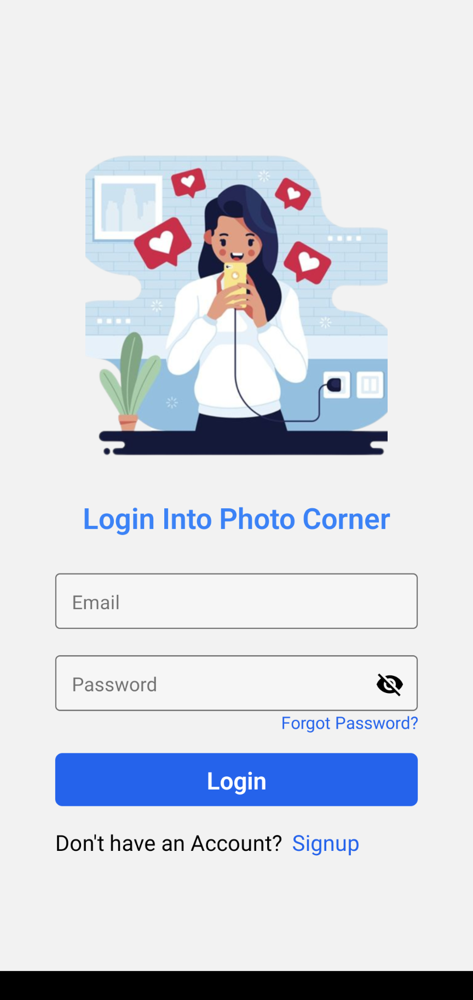
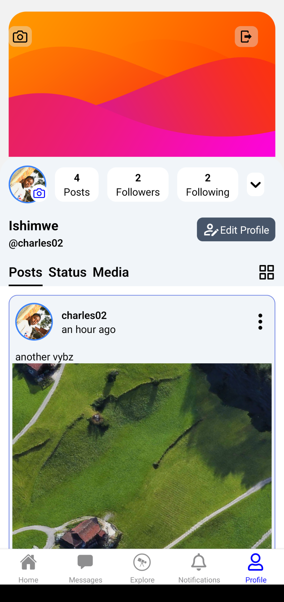
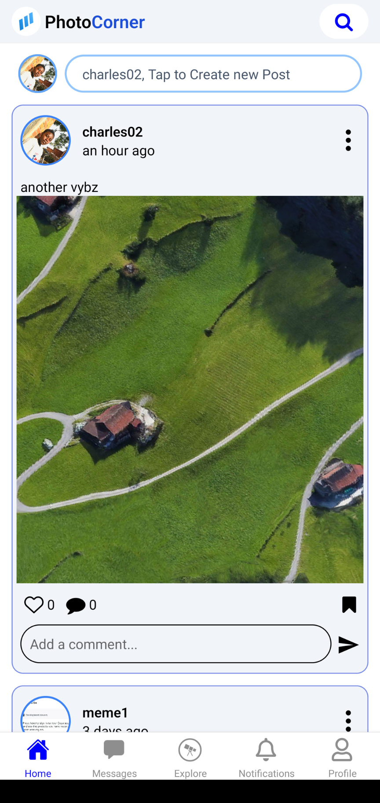

## Photo Corner Mobile App
chat and share images and thought with your fireands

## Download
Download app from <a href='https://github.com/NdungutseCharles103/Photo_Corner_RN/releases' target='_blank'>here</a>

## installation
1. Download app from <a href='https://github.com/NdungutseCharles103/Photo_Corner_RN/releases' target='_blank'>here</a>
2. Install app on your phone
3. Create an account
4. Enjoy

## Contributing
Pull requests are welcome. For major changes, please open an issue first to discuss what you would like to change.

## License
[MIT](https://choosealicense.com/licenses/mit/)

## Author
<a href='https://ndungutsecharles.me/' target='_blank'>Ndungutse Charles</a>

## Screenshots

